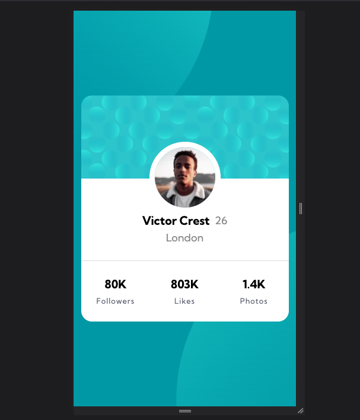
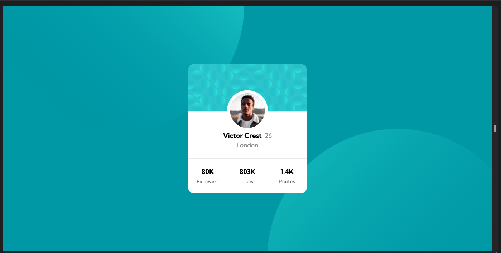

# Frontend Mentor - Profile card component solution

This is a solution to the [Profile card component challenge on Frontend Mentor](https://www.frontendmentor.io/challenges/profile-card-component-cfArpWshJ). Frontend Mentor challenges help you improve your coding skills by building realistic projects. 

## Table of contents

- [Overview](#overview)
  - [The challenge](#the-challenge)
  - [Screenshot](#screenshot)
- [My process](#my-process)
  - [Built with](#built-with)
  - [What I learned](#what-i-learned)
  - [Continued development](#continued-development)
- [Author](#author)


## Overview

### The challenge

- Build out the project to the designs provided

### Screenshot
#### Mobile


#### Desktop


### Links

- Solution URL: [Solution URL](https://github.com/Kamania/profile-card-component-main)
- Live Site URL: [Live site URL](https://profile-card-component-main-six-beryl.vercel.app/)

## My process

### Built with

- Semantic HTML5 markup
- CSS custom properties
- Flexbox
- CSS Grid
- Mobile-first workflow
- 
### What I learned

I managed to learn how to include 2 background images and position them
To see how you can add code snippets, see below:

```html
<main>...</main>
```
```css
body{
  font-family: 'Kumbh Sans', sans-serif;
  font-size: 18px;
  min-height: 100vh;
  display: flex;
  justify-content: center;
  align-items: center;
  background-image: url("images/bg-pattern-top.svg"), url("images/bg-pattern-bottom.svg");
  background-position: -8% -54vh, 108vh 50vh;
  background-repeat: no-repeat;
  background-size: 42.5em , 42.5em;
  background-color: var(--dark-cyan);
}
```

### Continued development

I will be implementing the project using bootstrap css

## Author

- Frontend Mentor - [@Kamania](https://www.frontendmentor.io/profile/Kamania)
- Twitter - [@Josephkamania](https://twitter.com/Josephkamania)
